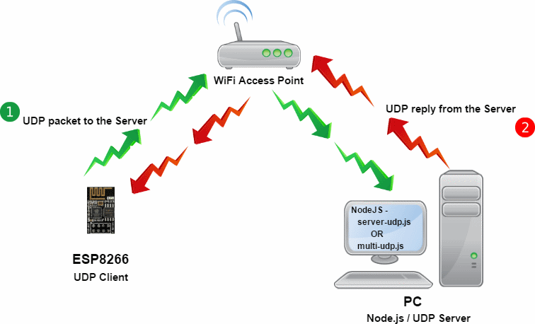

# ESP8266-udp

An ESP8266 project that uses UDP to send messages to a server. 

* [Overview](#overview)
* [History](#history)
* [Running the Application](#running-the-application)
    * [A Server for Testing](#a-server-for-testing)
        * [NodeJS Testing Code](#nodejs-testing-code)
    * [Build and Run](#build-and-run)
* [Design Details](#design-details)
* [Code Details](#code-details)
* [Future Modifications](#future-modifications)
    * [JSON Data via UDP](#json-data-via-udp)
* [Links and References](#links-and-references)
    * [NodeMCU](#nodemcu)
    * [UDP](#udp)
    * [Recommended Reading](#recommended-reading)

# Overview

This project demonstrates the use of UDP on an ESP8266 (*NodeMCU v1.0*). It acts as a client and connects with a server. Software components included here come from some of my previous work, such as **[ESP8266-config-data-V2](https://github.com/jxmot/ESP8266-config-data-V2)**.

# History

I wanted to test the UDP capabilities of the ESP8266 platform before I implemented code in a project. This application and its accompanying *Node.js* applications will do just that. The areas I was intereseted in were -

* UDP one & two way communication between a device and a server.
* UDP multi-cast communication from devices to one or more servers, including replies from servers.

# Running the Application

Please read through this section and the files it links to at least once before proceeding. There are configuration changes you will need to make before running the applications.

## A Server for Testing

You will need a server capable of responding to the UDP packets sent from the sketch. A second ESP8266 could be set up as a server by using one of the many UDP examples found online. A good one is [Arduino/doc/esp8266wifi/udp-examples](https://github.com/esp8266/Arduino/tree/master/doc/esp8266wifi/udp-examples.rst) on Github. Please note that a *Packet Sender* example specific to this project will be provide later.

My **preferred** test server is NodeJS running a simple script. That's because I'm also developing a server to handle incoming data from sensors that will be on my network. And I've got experience writing Node.js applications.

### NodeJS Testing Code

In my current development set up I use *Visual Studio Code* to run and debug the UDP server code. However the examples found in the `nodejs` folder in this repository can be run from the command line - 

* `server-udp.js` - A simple server that listens for UDP packets containing text. After a packet is recevied it replies to the sender.
    * `client-udp.js` - A simple UDP client that sends packets containing text.
* `multi-udp.js` - A *multi-cast* UDP server that listens for messages on `224.0.0.1` and then replies to the sender via their IP address.

To see information and an example on using the scripts with this sketch right-click **[here](NODE_TESTAPP.md)** and open in a new tab or window.

## Build and Run

In order for the sketch to run on your network and use your UDP server some minor modifications must be made. To see some instructions on modifying it right-click **[here](APPRUN.md)** and open in a new tab or window.

# Design Details

This sketch behaves as a *client* and not as a *server* as shown in most ESP8266 UDP examples. In those examples the ESP8266 *responds* to a UDP packet with a reply. In this sketch it behaves as a client and sends a packet to a server and then it expects a reply from the server.

  

The sketch continuously alternates between sending a UDP packet and waiting for a reply. After a packet is sent a delay of 1 second occurs before it attempts to receive a reply.
 
 
 

  

# Code Details

The main sketch file - `ESP9266-udp.ino`, intentionally does not have a lot of code in it. Instead the code you would normally see is grouped into two types - 

**`esp8266-udp` Functions** : UDP initialization, send, and receive. To view function descriptions please right-click **[here](ESP8266_UDP_FUNC.md)** and open in a new tab or window.

**`esp8266-ino` Functions** : Miscellaneous and *reusable* functions. To view function descriptions please right-click **[here](ESP8266_INO_FUNC.md)** and open in a new tab or window.

# Future Modifications

Just some things I may experiment with. This section will get updated as I work on them.

## JSON Data via UDP

Create functions that can take an *object* and render them as JSON strings. Then send the JSON data to the server and expect a JSON response. The response will then be parsed into an object for use in the application. Possible uses are - 

* Obtaining configuration data.
* Registering a device with a server.
* Sending device/sensor data to a server.

# Links and References

## NodeMCU

* [NodeMCU Dev Kit](https://github.com/nodemcu/nodemcu-devkit-v1.0)
* [NodeMCU Documentation](https://nodemcu.readthedocs.io/en/master/)

## UDP

* [Arduino/doc/esp8266wifi/udp-class.rst](https://github.com/esp8266/Arduino/tree/master/doc/esp8266wifi/udp-class.rst) on Github
* [Arduino/doc/esp8266wifi/udp-examples.rst](https://github.com/esp8266/Arduino/tree/master/doc/esp8266wifi/udp-examples.rst) on Github

## NodeJS

* [UDP / Datagram Sockets | Node.js v6.9.3 Documentation](https://nodejs.org/docs/v6.9.3/api/dgram.html)

## Recommended Reading

To fully understand **ArduinoJson** and how to properly determine the appropriate size of the buffer needed for your JSON data I recommend that you read the following - 

* **ESP8266 SPIFFS - Flash File System** documentation, read this first - <http://esp8266.github.io/Arduino/versions/2.3.0/doc/filesystem.html>
* **ArduinoJson** documentation, start here - <https://bblanchon.github.io/ArduinoJson/>
* **ArduinoJson Avoiding Pitfalls**, this provides a very good explanation of common pitfalls as related to the ArduinoJson memory model - <https://bblanchon.github.io/ArduinoJson/doc/pitfalls/>
* **ArduinoJson Memory Model**, this explains how the memory model is allocated and information regarding buffer sizes and methods of allocation - <https://bblanchon.github.io/ArduinoJson/doc/memory/>
* **ArduinoJson Assistant** is a tool to aid in determining the correct buffer size based on a sample of the JSON you are working with - <https://bblanchon.github.io/ArduinoJson/assistant/>

 
 
&copy; 2017 James Motyl

---

